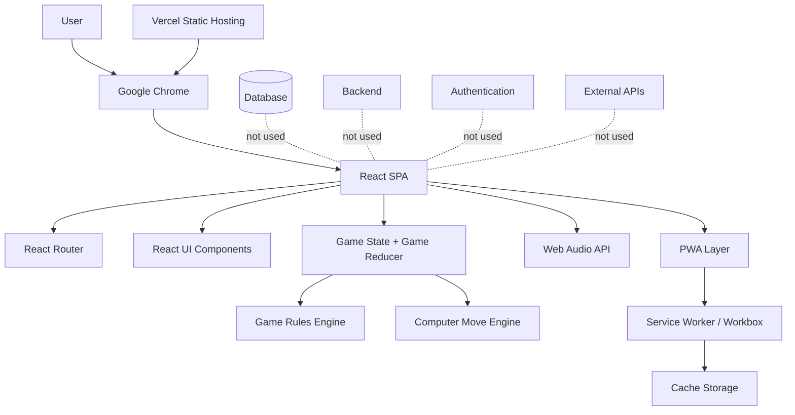

# ARCHITECTURE.md — איקס עיגול

## 1. מטרת המסמך

מסמך זה מגדיר את הארכיטקטורה הטכנית של אפליקציית **"איקס עיגול"** על בסיס ה-PRD וה-Technology Stack שאושר למחקר הטכנולוגי.

המטרה היא לספק מקור טכני ברור ומעשי שממנו ניתן להמשיך למימוש האפליקציה ללא צורך בקבלת החלטות ארכיטקטוניות מהותיות נוספות.

המסמך מתמקד בארכיטקטורה, רכיבי המערכת, חלוקת אחריות, זרימת מידע, החלטות טכניות, PWA/Offline, אבטחה, Hosting, Testing ותלויות. הוא אינו כולל Milestones, משימות, שלבי פיתוח או לוחות זמנים.

---

## 2. עקרונות ארכיטקטוניים

המערכת תיבנה לפי העקרונות הבאים:

1. **Frontend-only** — כל לוגיקת המשחק תרוץ בדפדפן.
2. **ללא Backend** — אין שרת אפליקטיבי, API Server או Serverless Functions.
3. **ללא Database** — אין שמירת משתמשים, משחקים, היסטוריה, סטטיסטיקות או הגדרות.
4. **ללא Authentication** — המשתמש נכנס ומשחק מיד.
5. **Offline-first לאחר התקנת ה-PWA** — קבצי האפליקציה הנדרשים להרצה יישמרו באמצעות Service Worker ו-Cache Storage.
6. **ללא תלות בשירותי Runtime חיצוניים** — המשחק חייב לפעול גם ללא אינטרנט.
7. **פשטות לפני הרחבה עתידית** — אין להוסיף תשתית שאינה נדרשת ל-MVP.
8. **לוגיקת Domain מופרדת מה-UI** — חוקי המשחק והחלטות המחשב ימומשו כפונקציות TypeScript טהורות ככל האפשר.
9. **State מקומי וברור** — מצב המשחק יישמר בזיכרון בלבד ויתאפס ב-Reload או ביציאה ממסך המשחק.
10. **Chrome-first** — ה-MVP נדרש לעבוד ב-Google Chrome במובייל וב-Desktop.

---

## 3. Technology Stack מחייב

| תחום | Technology |
|---|---|
| Programming Language | TypeScript |
| Frontend | React 19 |
| Build Tool | Vite 8 |
| Routing | React Router — Declarative Mode |
| State Management | React `useReducer` / `useState` |
| Styling | CSS או CSS Modules |
| Game Logic | Pure TypeScript functions |
| Computer Player | Heuristic algorithm + controlled randomness |
| PWA | `vite-plugin-pwa` |
| Service Worker | Workbox באמצעות `generateSW` |
| Offline Cache | Cache Storage דרך Workbox |
| Audio | Web Audio API |
| Backend | None |
| Database | None |
| Authentication | None |
| External APIs | None |
| AI / LLM Service | None |
| File Storage | None |
| Hosting | Vercel |
| Source Control | GitHub |
| Unit / Integration Testing | Vitest + React Testing Library |
| E2E / PWA Testing | Playwright |

אין להחליף טכנולוגיות אלה ללא שינוי מפורש של מסמך הארכיטקטורה.

---

## 4. התאמה בין ה-PRD ל-Technology Stack

לא קיימת סתירה מהותית בין ה-PRD לבין ה-Technology Stack.

הבהרות חשובות:

- השימוש ב-Vercel הוא **Hosting סטטי בלבד** ואינו מוסיף Backend.
- Workbox ו-Cache Storage משמשים לשמירת קבצי האפליקציה לצורך Offline ואינם מהווים שמירת Game State או תחליף ל-Database.
- אין שימוש ב-`localStorage`, `sessionStorage` או IndexedDB לשמירת מצב משתמש או משחק.
- אין שימוש ב-OpenAI, Gemini, Claude או שירות AI חיצוני. "AI" של המחשב הוא אלגוריתם מקומי ודטרמיניסטי ברובו עם רכיב randomness מבוקר.
- React Router משמש לניווט Client-Side בלבד.
- GitHub משמש לניהול קוד מקור בלבד ואינו חלק מ-Runtime של האפליקציה.

---

## 5. מבט על הארכיטקטורה

המערכת היא Single Page Application סטטית שמורדת לדפדפן ומריצה את כל הלוגיקה מקומית.



### זרימת Runtime

1. Chrome טוען את קבצי ה-SPA מ-Vercel או מה-Service Worker cache.
2. React מאותחל.
3. React Router קובע איזה מסך להציג.
4. במסך המשחק React מנהל Game State בזיכרון.
5. מהלך משתמש מועבר ל-Game Reducer.
6. מנוע חוקי המשחק בודק ניצחון או תיקו.
7. אם המשחק ממשיך, הלוח ננעל.
8. לאחר השהיה של כ-500ms מנוע המחשב בוחר מהלך.
9. מצב המשחק מתעדכן.
10. מתבצעת בדיקת תוצאה נוספת.
11. Audio ו-Animations מופעלים לפי האירוע.
12. כל המידע נמחק ב-Reload וביציאה ממסך המשחק.

---

## 6. מבנה Frontend

האפליקציה תחולק לארבע שכבות לוגיות:

### 6.1 Application Layer

אחראית על:

- Bootstrap של React.
- Router.
- Layout כללי.
- Navigation.
- PWA registration.
- Global CSS בסיסי.

רכיבים צפויים:

- `App`
- `AppRoutes`
- `Layout`
- `Navigation`

### 6.2 Feature Layer

פיצ'רים לפי מסכים:

- `home`
- `game`
- `about`

מסך המשחק יהיה הפיצ'ר היחיד שמכיל Domain Logic משמעותי.

### 6.3 Domain Layer

תכיל קוד TypeScript שאינו תלוי ב-React:

- בדיקת מהלך חוקי.
- זיהוי ניצחון.
- זיהוי תיקו.
- חישוב Winning Line.
- בחירת מהלך מחשב.
- יצירת Board חדש.

המטרה היא לאפשר Unit Tests ללוגיקת המשחק ללא DOM וללא React.

### 6.4 Infrastructure / Browser Layer

תכיל מעטפת סביב Browser APIs:

- Audio.
- PWA integration במידת הצורך.
- Utilities טכניים שאינם Domain Logic.

---

## 7. מבנה תיקיות מומלץ

```text
src/
├─ app/
│  ├─ App.tsx
│  ├─ AppRoutes.tsx
│  └─ app.css
│
├─ components/
│  ├─ layout/
│  │  ├─ Layout.tsx
│  │  └─ Navigation.tsx
│  └─ ui/
│
├─ features/
│  ├─ home/
│  │  └─ HomePage.tsx
│  │
│  ├─ game/
│  │  ├─ GamePage.tsx
│  │  ├─ GameBoard.tsx
│  │  ├─ GameCell.tsx
│  │  ├─ GameResult.tsx
│  │  ├─ NewGameButton.tsx
│  │  ├─ MuteButton.tsx
│  │  └─ game.css
│  │
│  └─ about/
│     └─ AboutPage.tsx
│
├─ game/
│  ├─ game.types.ts
│  ├─ game.constants.ts
│  ├─ game.reducer.ts
│  ├─ game.rules.ts
│  ├─ computer-player.ts
│  └─ game.initial-state.ts
│
├─ services/
│  └─ audio.service.ts
│
├─ utils/
│
├─ assets/
│  └─ icons/
│
├─ main.tsx
└─ index.css

public/
├─ pwa-192x192.png
├─ pwa-512x512.png
├─ favicon.ico
└─ optional-static-assets
```

אין ליצור תיקיות כגון:

- `server/`
- `api/`
- `database/`
- `auth/`
- `repositories/`

אלא אם הארכיטקטורה משתנה בעתיד.

---

## 8. Routing

המערכת כוללת שלושה מסכים:

| Route | מסך |
|---|---|
| `/` | Home |
| `/game` | Game |
| `/about` | About |

React Router יעבוד ב-Declarative Mode.

דוגמת מבנה:

```tsx
<Routes>
    <Route element={<Layout />}>
        <Route path="/" element={<HomePage />} />
        <Route path="/game" element={<GamePage />} />
        <Route path="/about" element={<AboutPage />} />
    </Route>
</Routes>
```

### החלטה: reset ביציאה ממסך המשחק

Game State ימוקם בתוך `GamePage` או בתוך hook שנוצר ומתפרק יחד איתו.

כאשר המשתמש עובר מ-`/game` למסך אחר, `GamePage` עובר unmount וכל מצב המשחק נעלם.

בחזרה ל-`/game` ייווצר Initial State חדש.

כך דרישת ה-PRD ל-reset בעת יציאה מתקיימת באופן טבעי, ללא Listener מיוחד וללא Global State.

---

## 9. מודל המידע של המשחק

### 9.1 טיפוסים

```ts
export type Player = "X" | "O";

export type CellValue = Player | null;

export type Board = [
    CellValue, CellValue, CellValue,
    CellValue, CellValue, CellValue,
    CellValue, CellValue, CellValue
];

export type GameStatus =
    | "playing"
    | "playerWon"
    | "computerWon"
    | "draw";

export interface GameState {
    board: Board;
    status: GameStatus;
    isComputerTurn: boolean;
    winningCells: number[];
    isMuted: boolean;
}
```

ה-Board ייוצג כמערך קבוע של 9 תאים.

יתרונות:

- לוגיקה פשוטה.
- גישה ישירה לפי index.
- קל לבצע בדיקות.
- קל להגדיר Winning Combinations.
- אין צורך במבנה דו-ממדי מורכב יותר.

### 9.2 Winning combinations

```ts
export const WINNING_LINES = [
    [0, 1, 2],
    [3, 4, 5],
    [6, 7, 8],
    [0, 3, 6],
    [1, 4, 7],
    [2, 5, 8],
    [0, 4, 8],
    [2, 4, 6]
] as const;
```

---

## 10. ניהול State

מצב המשחק ינוהל באמצעות `useReducer`.

אין צורך ב:

- Redux Toolkit.
- Zustand.
- MobX.
- Global Context עבור Game State.

### Actions מומלצים

```ts
type GameAction =
    | { type: "PLAYER_MOVE"; index: number }
    | { type: "START_COMPUTER_TURN" }
    | { type: "COMPUTER_MOVE"; index: number }
    | { type: "FINISH_GAME"; status: GameStatus; winningCells: number[] }
    | { type: "NEW_GAME" }
    | { type: "TOGGLE_MUTE" };
```

ניתן לפשט את מספר ה-Actions אם המימוש נשאר ברור.

### Invariants

ה-Reducer וה-UI חייבים לשמור על התנאים הבאים:

- X תמיד שייך למשתמש.
- O תמיד שייך למחשב.
- המשתמש תמיד מתחיל.
- אין שינוי בתא שאינו `null`.
- לא ניתן לבצע מהלך כאשר `isComputerTurn === true`.
- לא ניתן לבצע מהלך אם `status !== "playing"`.
- לא ניתן להפעיל שני תורי מחשב במקביל.
- `winningCells` מכיל רק את התאים של הרצף שהכריע את המשחק.
- `NEW_GAME` מאפס הכול פרט לכך שאין צורך לשמר `isMuted` מעבר לחיי ה-Page/Session לפי בחירת המימוש; ב-Reload הוא תמיד חוזר לברירת המחדל.

---

## 11. זרימת משחק

### 11.1 מהלך משתמש

1. המשתמש לוחץ על תא.
2. נבדק שהמשחק פעיל.
3. נבדק שזה אינו תור המחשב.
4. נבדק שהתא ריק.
5. X נכתב לתא.
6. מושמע SFX של X אם אינו Muted.
7. מופעלת אנימציית X.
8. מתבצעת בדיקת ניצחון.
9. אם המשתמש ניצח:
   - מצב המשחק עובר ל-`playerWon`.
   - התאים המנצחים נשמרים ב-`winningCells`.
   - הלוח נשאר נעול.
   - מושמע Win SFX.
10. אם הלוח מלא ללא מנצח:
    - `status = "draw"`.
11. אחרת:
    - `isComputerTurn = true`.
    - הלוח ננעל.
    - מתחיל delay של כ-500ms.

### 11.2 מהלך מחשב

לאחר כ-500ms:

1. נבדק שה-Component עדיין mounted.
2. נבדק שהמשחק עדיין במצב `playing`.
3. מחושב מהלך מחשב.
4. O נכתב לתא.
5. מושמע SFX של O אם אינו Muted.
6. מופעלת אנימציית O.
7. נבדק ניצחון מחשב.
8. אם המחשב ניצח:
   - `status = "computerWon"`.
   - התאים המנצחים נשמרים.
9. אחרת נבדק תיקו.
10. אם המשחק עדיין פעיל:
    - `isComputerTurn = false`.
    - הלוח חוזר להיות אינטראקטיבי.

---

## 12. Computer Player Architecture

אין שימוש ב-LLM, Machine Learning או API חיצוני.

המחשב ימומש באמצעות מנוע Heuristic מקומי.

### סדר החלטות מומלץ

1. **Win** — אם קיים מהלך שמנצח מיד, לבצע אותו.
2. **Block** — אם למשתמש קיים מהלך שמנצח בתור הבא, לחסום אותו.
3. **Center** — להעדיף את התא המרכזי במקרים מתאימים.
4. **Strategic move** — להעדיף corner או מהלך היוצר איום.
5. **Controlled imperfection** — בחלק מהמקרים לבחור מהלך חוקי אחר כדי שהמחשב לא יהיה בלתי מנוצח.
6. **Fallback** — לבחור תא חוקי אקראי.

### Randomness

הרכיב האקראי חייב להיות **מבוקר**.

המטרה אינה ליצור AI אקראי לחלוטין, אלא לשבור משחק מושלם כדי שהמשתמש יוכל לנצח.

דוגמה עקרונית:

```ts
if (winningMove !== null) return winningMove;

if (blockingMove !== null && Math.random() < BLOCK_PROBABILITY) {
    return blockingMove;
}

return chooseStrategicOrRandomMove(board);
```

הסתברות החסימה המדויקת היא Parameter פנימי שניתן לכוונן באמצעות בדיקות משחק, אך לא תוצג למשתמש כרמת קושי.

### כלל מרכזי

אין ליישם Minimax מושלם כברירת מחדל משום שה-PRD דורש מחשב חכם אך לא בלתי מנוצח.

---

## 13. תזמון ותור המחשב

ה-delay של המחשב ימומש ב-Frontend באמצעות `setTimeout`.

ערך ברירת מחדל:

```ts
const COMPUTER_MOVE_DELAY_MS = 500;
```

הטיימר חייב להתנקות ב-unmount כדי למנוע update לאחר יציאה ממסך המשחק.

דוגמה:

```ts
useEffect(() => {
    if (!state.isComputerTurn || state.status !== "playing") return;

    const timerId = window.setTimeout(() => {
        // calculate and dispatch computer move
    }, COMPUTER_MOVE_DELAY_MS);

    return () => window.clearTimeout(timerId);
}, [state.isComputerTurn, state.status, state.board]);
```

---

## 14. Audio Architecture

האפליקציה תשתמש ב-Web Audio API ולא בקבצי MP3/WAV.

### Audio Service

`audio.service.ts` יהיה אחראי על:

- יצירת `AudioContext`.
- יצירת `OscillatorNode`.
- יצירת Gain envelope קצר.
- צליל X.
- צליל O.
- צליל ניצחון.
- צליל הפסד.
- צליל תיקו.

Interface אפשרי:

```ts
class AudioService {
    public playX(): void;
    public playO(): void;
    public playWin(): void;
    public playLose(): void;
    public playDraw(): void;
}
```

Mute ייבדק ב-UI או בשירות.

### Browser Policy

יצירת או הפעלת `AudioContext` תבוצע רק לאחר Interaction של המשתמש במקרה שהדפדפן דורש זאת.

### Persistence

`isMuted` לא יישמר ב:

- localStorage
- sessionStorage
- IndexedDB
- Cookie

Reload של האפליקציה מחזיר את מצב השמע לברירת המחדל.

---

## 15. UI Components

### Layout

`Layout` יכיל:

- Navigation קבוע לוגית בכל המסכים.
- `<Outlet />` עבור תוכן ה-Route.

### HomePage

מציג:

- שם המשחק.
- תיאור קצר.
- ניווט.

אין State עסקי.

### GamePage

אחראי על:

- Game State.
- Game orchestration.
- Computer turn timer.
- Audio triggers.
- New Game.
- Mute.

### GameBoard

מקבל:

```ts
interface GameBoardProps {
    board: Board;
    disabled: boolean;
    winningCells: number[];
    onCellClick: (index: number) => void;
}
```

### GameCell

מקבל:

- ערך X/O/null.
- disabled.
- האם הוא חלק מ-Winning Line.
- click handler.

הוא אינו מכיל Game Logic.

### GameResult

מציג:

- ניצחת.
- הפסדת.
- תיקו.

הטקסט בפועל יהיה בעברית.

### AboutPage

מציג את הטקסט שהוגדר ב-PRD:

>פותח על ידי איתי גולדנברג

---

## 16. Styling ו-RTL

### כיוון

ברמת ה-HTML:

```html
<html lang="he" dir="rtl">
```

בנוסף ניתן להגדיר:

```css
html {
    direction: rtl;
}
```

### Board

לוח המשחק ימומש ב-CSS Grid:

```css
.game-board {
    display: grid;
    grid-template-columns: repeat(3, 1fr);
}
```

### Responsive

הלוח חייב:

- להיכנס למסכי Mobile ללא horizontal scroll.
- לשמור על תאים מרובעים.
- לספק touch targets נוחים.
- לעבוד גם ב-Desktop.

מומלץ להשתמש ב:

```css
aspect-ratio: 1;
```

עבור התאים ו-`min()` / `clamp()` עבור גודל הלוח.

### Animations

Animations ימומשו ב-CSS ככל האפשר.

נדרשות לפחות:

- כניסת X.
- כניסת O.
- Highlight ל-Winning Line.

אין להשתמש בספריית Animation חיצונית אלא אם נוצר צורך שאי אפשר לפתור באופן סביר ב-CSS.

---

## 17. PWA Architecture

PWA ינוהל באמצעות:

- `vite-plugin-pwa`
- Workbox
- `generateSW`

### Manifest

ה-PWA manifest יכלול לכל הפחות:

```ts
manifest: {
    name: "איקס עיגול",
    short_name: "איקס עיגול",
    lang: "he",
    dir: "rtl",
    start_url: "/",
    display: "standalone",
    theme_color: "...",
    background_color: "...",
    icons: [
        {
            src: "/pwa-192x192.png",
            sizes: "192x192",
            type: "image/png"
        },
        {
            src: "/pwa-512x512.png",
            sizes: "512x512",
            type: "image/png"
        }
    ]
}
```

צבעים ייקבעו בהתאם לעיצוב הסופי.

### Service Worker

Service Worker ייווצר בזמן Build באמצעות Workbox.

אין לכתוב Service Worker מותאם ידנית אלא אם מתגלה Requirement שלא ניתן לממש באמצעות `generateSW`.

### Precache

יש לשמור ב-Precache את קבצי ה-App Shell:

- HTML.
- JS.
- CSS.
- PWA icons.
- Static assets הדרושים להרצת האפליקציה.

כך לאחר טעינה/התקנה תקינה המשחק יוכל להיפתח Offline.

### Offline Requirement

Offline חייב לתמוך לפחות ב:

- `/`
- `/game`
- `/about`
- כל JS/CSS שנדרש.
- icons.
- כל asset מקומי.

מכיוון שאין API, Database או Backend, אין צורך ב-Offline synchronization.

---

## 18. Cache Strategy

### App Shell

האסטרטגיה העיקרית היא Precache בזמן Build.

### Runtime Cache

אין צורך משמעותי ב-Runtime caching מכיוון שאין External APIs או תוכן דינמי.

אם קיימים assets שלא נכללו ב-precache, ניתן להשתמש ב-Cache First עבור assets immutable בלבד.

### Versioning

Workbox ינהל revisions לפי Build output.

כאשר מתבצע Deployment חדש, ה-Service Worker החדש יעדכן את cache לפי הגרסאות החדשות.

### Game Data

Game State לעולם לא יישמר ב-Cache Storage.

---

## 19. Backend

אין Backend.

לא יהיו:

- Node.js server.
- Express.
- NestJS.
- Fastify.
- API Routes.
- Serverless Functions.
- WebSockets.
- Queues.
- Background Workers.

כל חוקי המשחק רצים ב-Client.

אם בעתיד תתווסף דרישה המחייבת Backend, יש לעדכן מסמך זה לפני המימוש.

---

## 20. Database

אין Database.

לא משתמשים ב:

- PostgreSQL.
- MySQL.
- MongoDB.
- Firebase Firestore.
- Supabase.
- SQLite.
- IndexedDB.

אין Data Model מתמשך.

כל State קיים בזיכרון JavaScript בלבד.

---

## 21. Authentication ו-Authorization

אין Authentication.

אין:

- Login.
- Register.
- JWT.
- OAuth.
- Cookies של Session.
- Roles.
- Permissions.

כתוצאה מכך אין Authorization Layer.

כל משתמש מקבל אותה פונקציונליות.

---

## 22. APIs

### Application APIs

אין REST API ואין GraphQL API.

### External APIs

אין External APIs.

### Browser APIs

המערכת משתמשת רק ב-Browser APIs הנדרשים:

- Web Audio API.
- Service Worker API.
- Cache Storage API.
- History API דרך React Router.
- Timers (`setTimeout`).

אין צורך ב-Fetch/Axios במהלך המשחק.

---

## 23. AI Services

אין שימוש בשירות AI חיצוני.

לא משתמשים ב:

- OpenAI.
- Gemini.
- Claude.
- Azure OpenAI.
- Hugging Face inference.
- AI SDK חיצוני.

ה-"AI" של המשחק הוא Computer Player מקומי המבוסס על heuristics.

יתרונות ההחלטה:

- Offline מלא.
- אפס עלות API.
- אין latency רשת.
- אין API key.
- אין צורך ב-Backend להגנת secrets.
- התנהגות צפויה.
- התאמה לדרישת "חכם אך ניתן לניצחון".

---

## 24. File Storage

אין Cloud File Storage.

אין:

- S3.
- Cloudinary.
- Firebase Storage.
- Supabase Storage.
- Blob Storage.

Assets סטטיים בלבד יהיו חלק מה-project repository או `public/`.

ב-production הם יוגשו מ-Vercel CDN.

---

## 25. Cloud Infrastructure

### Provider

Vercel.

### סוג Deployment

Static SPA Deployment בלבד.

### Build

```text
npm install
npm run build
```

Output:

```text
dist/
```

### Runtime

אין Compute Runtime של האפליקציה.

Vercel אחראית רק ל:

- HTTPS.
- CDN.
- Static asset delivery.
- Deployment.
- Preview deployments.
- DNS אם יחובר domain מותאם.

### Environment Variables

ל-MVP אין צורך ב-Environment Variables רגישים.

אין API keys.

אין secrets.

אם Vite configuration משתמש ב-variables עיצוביים או Build-time שאינם secrets, ניתן להשתמש ב-`VITE_*`, אך אין סיבה להוסיף אותם ללא צורך.

---

## 26. SPA Routing ב-Vercel

יש לוודא ש-Direct Navigation ל:

- `/game`
- `/about`

מחזיר את `index.html` של ה-SPA ולא HTTP 404.

אם Vercel אינה מזהה את ה-routing בצורה הרצויה אוטומטית, יש להשתמש ב-Rewrite configuration.

דוגמה אפשרית:

```json
{
    "rewrites": [
        {
            "source": "/(.*)",
            "destination": "/index.html"
        }
    ]
}
```

יש לוודא שה-Rewrite אינו שובר static assets.

---

## 27. Security Architecture

למרות שהמערכת פשוטה ואינה מטפלת במידע רגיש, יש לשמור על Security בסיסי.

### 27.1 Secrets

אין Secrets ב-Frontend.

לעולם אין להכניס:

- API key פרטי.
- Token.
- Password.
- Service account.

### 27.2 User Input

אין טקסט חופשי ממשתמשים ב-MVP ולכן שטח התקיפה קטן מאוד.

### 27.3 XSS

אין להשתמש ב:

```tsx
dangerouslySetInnerHTML
```

ללא צורך מפורש ובדיקה מתאימה.

כל הטקסטים יוצגו כ-React text content רגיל.

### 27.4 Dependencies

יש לשמור על מספר Dependencies נמוך.

Dependencies עיקריים בלבד:

- React.
- React DOM.
- React Router.
- vite-plugin-pwa.
- Tooling/Test dependencies.

אין להוסיף package עבור פעולה שניתן לממש בפשטות באמצעות Web Platform או TypeScript.

### 27.5 HTTPS

Production יוגש רק ב-HTTPS דרך Vercel.

HTTPS נדרש גם לחלק מיכולות ה-PWA/Service Worker.

### 27.6 Content Security

אין חובה ל-CSP מורכב עבור ה-MVP, אך ניתן להוסיף Security Headers בסיסיים ב-Hosting אם אינם פוגעים ב-PWA.

אין צורך ב-CORS configuration משום שאין API.

---

## 28. Privacy

האפליקציה אינה אמורה לאסוף מידע אישי.

אין:

- Accounts.
- Analytics.
- Tracking.
- Cookies לצורכי משתמש.
- Game history.
- User profiles.

לכן ברמת ה-MVP אין Data Retention architecture.

אם בעתיד יתווסף Analytics, יש לבצע החלטה נפרדת לגבי Privacy ו-Consent.

---

## 29. Error Handling

### Game Logic

פונקציות Domain צריכות להעדיף predictable behavior.

לדוגמה:

- click על index לא חוקי — לא לשנות State.
- click על תא תפוס — להתעלם.
- מהלך בזמן Computer Turn — להתעלם.
- מהלך אחרי Game Over — להתעלם.

### Audio

כשל ב-Web Audio API לא יפיל את המשחק.

Audio הוא Enhancement בלבד.

### PWA

גם אם Service Worker אינו נרשם, Online mode של האפליקציה חייב להמשיך לעבוד.

### Unexpected Rendering Error

ניתן להוסיף React Error Boundary ברמת האפליקציה אם רוצים שכבת הגנה בסיסית, אך אין צורך במערכת Error Monitoring חיצונית ב-MVP.

---

## 30. Performance

המערכת קטנה ולכן אין צורך ב-Performance architecture מורכבת.

החלטות:

- Bundle קטן.
- ללא UI framework כבד.
- ללא Redux.
- ללא HTTP requests בזמן המשחק.
- ללא images גדולות שאינן נחוצות.
- CSS animations במקום animation runtime library.
- שימוש ב-static assets עם hashing.
- precache של App Shell.

אין צורך ב:

- SSR.
- CDN נוסף מעבר ל-Vercel.
- Redis.
- Edge Functions.
- Image optimization service.
- Code splitting אגרסיבי.

Route-level lazy loading הוא אופציונלי, אך אינו הכרחי עבור שלושה מסכים קטנים.

---

## 31. Accessibility בסיסית

למרות שאין דרישות Accessibility מיוחדות ב-PRD, יש לשמור על שימושיות בסיסית.

החלטות:

- תאי המשחק ימומשו כ-`button` או אלמנט אינטראקטיבי סמנטי שקול.
- כפתורים יהיו נגישים למקלדת.
- `disabled` ייצג חסימה אמיתית כאשר מתאים.
- X ו-O לא יוצגו רק באמצעות צבע.
- הודעת תוצאה תוצג בטקסט.
- contrast בסיסי יהיה קריא.
- Focus states לא יוסרו ללא חלופה.
- שפת המסמך תהיה `he`.

אין צורך ב-Accessibility framework חיצוני.

---

## 32. Testing Architecture

### 32.1 Unit Tests — Vitest

יש לבדוק במיוחד את Domain Layer.

פונקציות עיקריות לבדיקה:

- `getWinner`
- `getWinningLine`
- `isDraw`
- `isValidMove`
- `getAvailableMoves`
- `chooseComputerMove`
- reducer transitions

תרחישים מרכזיים:

- כל 8 Winning Lines.
- תיקו.
- Board חלקי.
- ניסיון לשחק בתא תפוס.
- מהלך לאחר Game Over.
- מחשב מנצח כאשר קיימת אפשרות.
- מחשב חוסם איום כאשר האלגוריתם בוחר לחסום.
- מחשב מחזיר רק תא חוקי.

### 32.2 Component / Integration — React Testing Library

יש לבדוק:

- click על תא מוסיף X.
- board ננעל בזמן Computer Turn.
- result message מוצגת.
- New Game מאפס.
- winning cells מקבלים מצב Highlight.
- Mute משנה את מצב השמע.
- ניווט עובד.

### 32.3 E2E — Playwright

Chrome/Chromium יהיה ה-browser העיקרי.

יש לבדוק:

- Home → Game.
- משחק מלא.
- New Game.
- Game → About → Game גורם ל-reset.
- responsive viewport של Mobile.
- responsive viewport של Desktop.
- direct navigation ל-`/game`.
- reload של route.
- PWA/Service Worker במידת האפשר בסביבת test מתאימה.
- Offline לאחר שה-app shell נשמר.

---

## 33. Testability של Randomness

כדי שה-Computer Player יהיה ניתן לבדיקה, אין לקשור אותו ישירות ל-`Math.random()` בכל עומק הלוגיקה.

מומלץ לאפשר dependency injection לפונקציית random:

```ts
type RandomFn = () => number;

export function chooseComputerMove(
    board: Board,
    random: RandomFn = Math.random
): number {
    // ...
}
```

ב-production:

```ts
chooseComputerMove(board);
```

ב-tests:

```ts
chooseComputerMove(board, () => 0.25);
```

כך ניתן לקבל Unit Tests דטרמיניסטיים.

---

## 34. Constants

ערכים שאינם State ויש להם משמעות מערכתית יוגדרו כ-constants.

לדוגמה:

```ts
export const COMPUTER_MOVE_DELAY_MS = 500;
export const PLAYER: Player = "X";
export const COMPUTER: Player = "O";
```

Probability values של Computer Player יוגדרו במקום אחד ולא יפוזרו בקוד.

---

## 35. Coding Guidelines

### TypeScript

- `strict: true`.
- להימנע מ-`any`.
- להשתמש ב-union types עבור מצבים סגורים.
- להעדיף pure functions בלוגיקת המשחק.
- להפריד UI מ-Domain.
- אין לבצע mutation ישיר ל-State של React.

### React

- Functional Components בלבד.
- Hooks בלבד.
- Components קטנים עם אחריות ברורה.
- אין Global State ללא צורך.
- אין לבצע Game Logic משמעותי בתוך JSX.

### CSS

- שמות classes ברורים.
- RTL מהבסיס.
- Mobile-first או responsive ברור ועקבי.
- להימנע מ-inline styles עבור styling משמעותי.
- animation state יכול להתבסס על classes/data attributes.

---

## 36. Build Configuration

### TypeScript

יש להפעיל strict mode.

### Vite

Vite ישמש ל:

- development server.
- TypeScript/JSX transformation.
- production build.
- asset hashing.
- PWA plugin integration.

### PWA Plugin

מבנה עקרוני:

```ts
VitePWA({
    registerType: "autoUpdate",
    strategies: "generateSW",
    manifest: {
        name: "איקס עיגול",
        short_name: "איקס עיגול",
        lang: "he",
        dir: "rtl",
        display: "standalone",
        start_url: "/"
    }
})
```

ניתן לשנות `registerType` אם UX של עדכון Service Worker דורש זאת, אך אין לבנות Update UI ייעודי ללא Requirement.

---

## 37. Dependency Policy

הפרויקט יאמץ Dependency מינימלי.

### Runtime dependencies צפויים

```text
react
react-dom
react-router-dom
```

### Build/PWA

```text
vite
typescript
vite-plugin-pwa
```

### Testing

```text
vitest
@testing-library/react
@testing-library/jest-dom
playwright או @playwright/test
```

אין להוסיף dependency חדש ללא צורך ברור.

---

## 38. Git ו-Repository

GitHub ישמש כ-Source Control.

Branches ו-workflow אינם מוגדרים כמחויבים במסמך זה.

יש לשמור ב-Repository:

- Source code.
- Configurations.
- PWA assets.
- Tests.
- `package.json`.
- lock file.
- Documentation.

אין לשמור:

- `node_modules`.
- Build output אם אינו נדרש.
- Secrets.
- `.env` עם מידע רגיש.

---

## 39. Hosting ו-Deployment Contract

כל build מוצלח חייב להפיק SPA סטטי שניתן להגיש ללא Backend.

Contract:

```text
Input:
Source repository

Build:
npm run build

Output:
dist/

Runtime dependencies:
None

Required platform capabilities:
HTTPS
Static file hosting
SPA rewrite
Service Worker support
```

Vercel היא ספק ה-Hosting שנבחר.

הארכיטקטורה עצמה אינה תלויה ב-Vercel-specific APIs ולכן ניתן להעביר בעתיד את `dist/` לספק Static Hosting אחר ללא שינוי משמעותי בקוד.

---

## 40. Observability

אין Analytics ואין Monitoring חיצוני ב-MVP.

ב-Development ניתן להשתמש ב:

- browser console.
- React DevTools.
- Vite development output.
- Playwright traces בעת בדיקות.

אין צורך ב:

- Sentry.
- Datadog.
- LogRocket.
- OpenTelemetry.

אם יתווסף monitoring בעתיד, עליו להיות opt-in ארכיטקטוני ולא תלות של Game Domain.

---

## 41. Scalability

מכיוון שהמערכת היא Static Frontend, scaling פשוט:

- כל משתמש מקבל assets סטטיים.
- כל Game Logic רץ במכשיר המשתמש.
- אין Server State.
- אין Database Connections.
- אין API throughput.
- אין concurrent game sessions בשרת.

לכן מספר המשתמשים אינו יוצר עומס עסקי על Backend שאינו קיים.

המגבלה העיקרית היא Static Hosting/CDN bandwidth, שאותה Vercel מנהלת.

---

## 42. Failure Domains

המערכת מצמצמת נקודות כשל למספר קטן מאוד.

### כשל Hosting

אם המשתמש כבר התקין/טען את PWA וקבצי App Shell נמצאים ב-cache, המשחק אמור להמשיך לעבוד Offline.

### כשל אינטרנט

המשחק ממשיך לעבוד לאחר שה-assets הדרושים זמינים ב-Service Worker cache.

### כשל Audio

המשחק ממשיך ללא סאונד.

### כשל Service Worker Registration

המשחק עדיין עובד Online, אך Offline capability אינה מובטחת עד לתיקון הרישום.

אין כשל Database/API/Auth משום שרכיבים אלה אינם קיימים.

---

## 43. החלטות שאינן משתמעות ישירות מה-PRD

### 43.1 Board representation

החלטה: מערך TypeScript של 9 תאים.

סיבה: פשוט, testable ומתאים ישירות ללוח 3×3.

### 43.2 Game state lifecycle

החלטה: Game State חי בתוך Game Route.

סיבה: unmount טבעי מממש את דרישת reset ביציאה מהמשחק.

### 43.3 State management

החלטה: `useReducer`.

סיבה: קיימים מספר state transitions קשורים אך אין הצדקה ל-State library חיצונית.

### 43.4 Computer strategy

החלטה: Heuristics + randomness מבוקר.

סיבה: מאפשר יריב חכם אך לא בלתי מנוצח.

### 43.5 Audio implementation

החלטה: Web Audio API.

סיבה: ה-PRD מבקש צלילים מסונתזים ואין צורך ב-assets חיצוניים.

### 43.6 SPA Hosting

החלטה: Vercel Static Hosting.

סיבה: deployment פשוט, HTTPS, CDN ו-preview deployments ללא Backend.

### 43.7 Offline implementation

החלטה: Workbox `generateSW`.

סיבה: דרישות ה-offline פשוטות ואינן דורשות Service Worker מותאם ידנית.

---

## 44. Non-Goals ארכיטקטוניים

ב-MVP אין לתכנן או להוסיף:

- Multiplayer.
- Real-time networking.
- User Accounts.
- Login/Register.
- Backend.
- Database.
- Leaderboard.
- Game history.
- Statistics.
- Cloud save.
- Difficulty selector.
- User-selectable X/O.
- Server-side AI.
- Generative AI.
- Analytics.
- Push notifications.
- PWA install button ייעודי.
- Cross-browser compatibility מעבר לדרישות ה-PRD.
- Persistence של mute.
- Persistence של game state.

---

## 45. Source of Truth למימוש

בעת מימוש יש לפעול לפי סדר העדיפות הבא במקרה של אי-בהירות:

1. **PRD** — קובע התנהגות מוצרית ו-Scope.
2. **ARCHITECTURE.md** — קובע כיצד הדרישות ימומשו טכנית.
3. **Technology Stack** — קובע את הטכנולוגיות המאושרות.
4. **קוד קיים** — כפוף לשלושת המקורות לעיל.

אם מתגלה סתירה בין המימוש לבין PRD/Architecture, אין להרחיב את המוצר על דעת המפתח או מערכת ה-AI. יש להעדיף את ה-Scope המוגדר במסמכים.

---

## 46. סיכום ארכיטקטוני

האפליקציה היא React SPA סטטית, כתובה ב-TypeScript ונבנית באמצעות Vite.

כל Game State ולוגיקת המשחק נמצאים ב-Client בלבד.

React Router מספק ניווט בין Home, Game ו-About.

המשחק משתמש ב-`useReducer` עבור State מקומי, בפונקציות TypeScript טהורות עבור חוקי המשחק, וב-Heuristic Computer Player מקומי עם randomness מבוקר כדי לספק יריב חכם אך ניתן לניצחון.

Web Audio API מייצר את כל האפקטים הקוליים ללא קבצי שמע חיצוניים.

`vite-plugin-pwa` ו-Workbox מספקים Service Worker, precache ויכולת Offline.

אין Backend, Database, Authentication, External API, Cloud File Storage או AI Service חיצוני.

Vercel מגישה את קבצי ה-build הסטטיים באמצעות HTTPS/CDN.

הארכיטקטורה מכוונת למינימום מורכבות, מספר קטן של dependencies, עבודה מלאה ללא אינטרנט לאחר caching/installation, ויכולת בדיקה גבוהה של לוגיקת המשחק.
