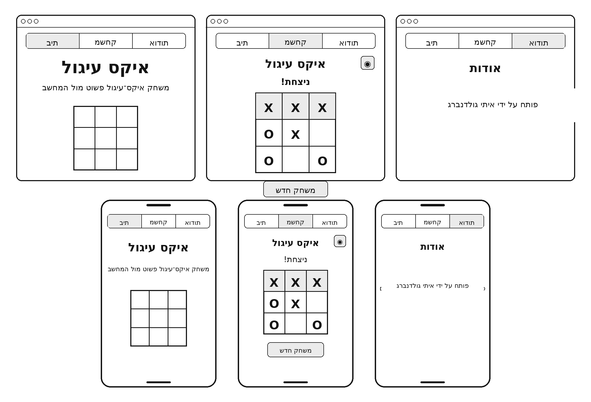
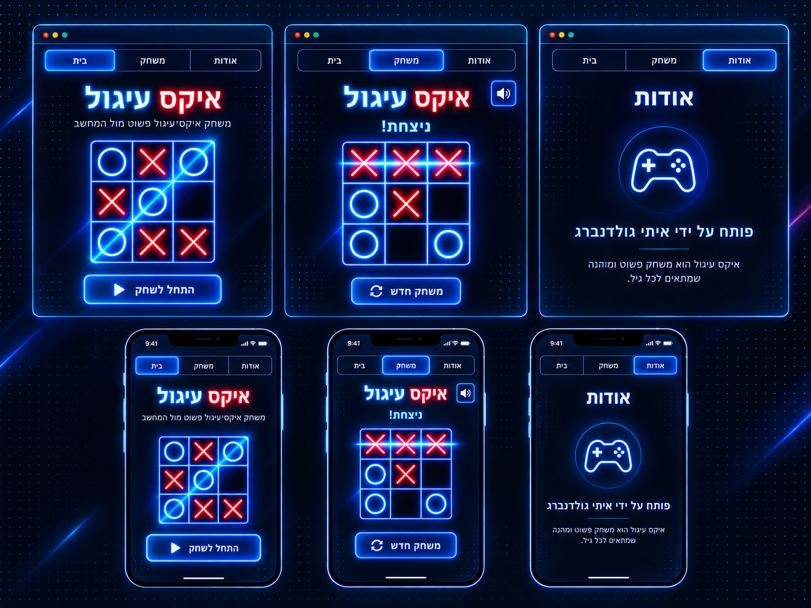
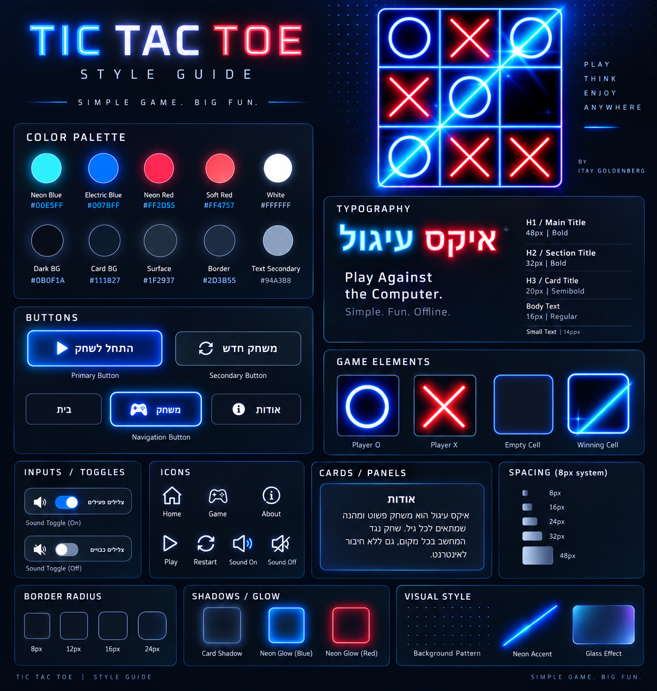

# DESIGN.md — איקס עיגול

מסמך זה מתאר את מבנה המסכים ואת השפה החזותית של אפליקציית **"איקס עיגול"**.  
הוא מבוסס על ה-Wireframes, ה-Mockups וה-Style Guide שנוצרו עבור המוצר, תוך שמירה על עקרונות ה-UX שהוגדרו ב-PRD: ממשק פשוט, ברור, מהיר, בעברית ובכיוון RTL, מותאם ל-Mobile ול-Desktop, ללא עומס מיותר וללא פיצ'רים שאינם חלק מה-MVP.

## תמונות ייחוס

### Wireframes


### Mockups


### Style Guide


---

# 1. Screens

## 1.1 מסך הבית

### מטרה

מסך הבית הוא נקודת הכניסה לאפליקציה.  
המטרה שלו היא להסביר מיד מהו המוצר ולאפשר למשתמש לעבור במהירות למשחק.

המסך צריך להיות פשוט, ללא מידע מיותר וללא צורך בהרשמה או בהגדרה מוקדמת.

### מה יש במסך

- כותרת ראשית: **"איקס עיגול"**.
- תיאור קצר של המשחק.
- אלמנט חזותי של לוח איקס-עיגול, בהתאם ל-Mockup.
- כפתור פעולה ראשי: **"התחל לשחק"**.
- תפריט ניווט קבוע הכולל:
  - **בית**
  - **משחק**
  - **אודות**

### מה קורה במסך

- לחיצה על **"התחל לשחק"** מעבירה למסך המשחק.
- לחיצה על **"משחק"** בתפריט הניווט מעבירה למסך המשחק.
- לחיצה על **"אודות"** מעבירה למסך האודות.
- אין טפסים, הרשמה, בחירת רמת קושי או הגדרות נוספות.

### UX

הפעולה המרכזית במסך היא התחלת משחק ולכן כפתור **"התחל לשחק"** צריך להיות האלמנט האינטראקטיבי הבולט ביותר.

---

## 1.2 מסך המשחק

### מטרה

מסך המשחק הוא המסך המרכזי של האפליקציה.  
במסך זה המשתמש משחק כ-X מול המחשב, שמשחק כ-O.

המשתמש תמיד מתחיל ראשון.

### מה יש במסך

- כותרת: **"איקס עיגול"**.
- לוח משחק בגודל **3×3**.
- סימוני X ו-O בתאים.
- כפתור **Mute / Unmute** עבור אפקטים קוליים.
- הודעת תוצאה בסיום משחק:
  - ניצחון.
  - הפסד.
  - תיקו.
- הדגשה חזותית של שלושת התאים המנצחים במקרה של ניצחון.
- כפתור **"משחק חדש"**.
- תפריט ניווט קבוע:
  - **בית**
  - **משחק**
  - **אודות**

### מה קורה במסך

1. המשתמש לוחץ על תא פנוי.
2. X מופיע בתא עם אנימציה קצרה.
3. מיד לאחר המהלך, הלוח נחסם זמנית לאינטראקציה.
4. לאחר השהיה של כ-0.5 שניות המחשב מבצע מהלך ומציג O.
5. המשחק בודק לאחר כל מהלך אם קיים ניצחון או תיקו.
6. אם המשחק ממשיך, הלוח חוזר להיות זמין למשתמש.
7. בסיום משחק:
   - מוצגת הודעת התוצאה.
   - הרצף המנצח מודגש, אם קיים.
   - הלוח נשאר במצב הסופי.
   - לא ניתן לבצע מהלכים נוספים.
8. לחיצה על **"משחק חדש"** מאפסת את הלוח ומתחילה משחק חדש.

### Mute / Unmute

- כפתור השמע מאפשר לכבות ולהפעיל את האפקטים הקוליים.
- השינוי משפיע רק על ההפעלה הנוכחית.
- מצב ההשתקה אינו נשמר לאחר סגירה או Reload.

### ניווט מתוך המשחק

- מעבר מ-"משחק" אל "בית" או "אודות" מאפס את המשחק הנוכחי.
- כאשר המשתמש חוזר למסך המשחק, מוצג לוח חדש וריק.

### UX

- אין להציג חיווי טקסטואלי קבוע כגון **"התור שלך"** או **"המחשב חושב"**.
- בזמן שהמחשב מבצע מהלך, הלוח עצמו נעול וכך ברור שלא ניתן לבצע פעולה נוספת.
- תאי הלוח צריכים להיות גדולים וברורים מספיק גם במסכים קטנים.
- X ו-O צריכים להיות מובחנים היטב גם באמצעות צורה ולא רק באמצעות צבע.

---

## 1.3 מסך אודות

### מטרה

מסך האודות מציג מידע קצר על יוצר האפליקציה.

### מה יש במסך

- כותרת: **"אודות"**.
- טקסט מרכזי:
  - **"פותח על ידי איתי גולדנברג"**
- אלמנט חזותי פשוט בהתאם ל-Mockup, כל עוד הוא אינו מוסיף פונקציונליות חדשה.
- תפריט הניווט הקבוע:
  - **בית**
  - **משחק**
  - **אודות**

### מה קורה במסך

- המסך הוא אינפורמטיבי בלבד.
- לחיצה על **"בית"** מעבירה למסך הבית.
- לחיצה על **"משחק"** מעבירה למסך המשחק.
- אין טפסים, כפתורי פעולה נוספים או מידע אינטראקטיבי.

---

## 1.4 ניווט בין המסכים

הניווט קבוע ועקבי בכל האפליקציה.

מבנה הניווט:

```text
בית
 ├─> משחק
 └─> אודות

משחק
 ├─> בית
 └─> אודות

אודות
 ├─> בית
 └─> משחק
```

המסכים המרכזיים היחידים הם:

1. **בית**
2. **משחק**
3. **אודות**

אין להוסיף מסכי Login, Settings, Profile, Difficulty, Statistics או כל מסך אחר שאינו חלק מה-PRD.

---

# 2. Style Guide

## 2.1 כיוון עיצובי כללי

השפה החזותית מבוססת על משחקי ארקייד וניאון מודרניים.

העיצוב משלב:

- רקע כחול-שחור כהה.
- ניאון כחול עבור O, קווי ממשק ואלמנטים פעילים.
- ניאון אדום עבור X.
- כותרות וטקסט לבנים.
- Panels כהים עם גבולות כחולים עדינים.
- Glow סביב רכיבים מרכזיים.
- תחושת Digital / Arcade / Cyber, אך עם מבנה UI נקי ולא עמוס.

העיצוב צריך להרגיש חי ומשחקי, אך להישאר ברור וקל לשימוש.

---

## 2.2 Color Palette

### צבעים ראשיים

| שימוש | צבע | HEX |
|---|---|---|
| Neon Cyan / Blue | כחול-ציאן זוהר | `#00E5FF` |
| Electric Blue | כחול פעיל | `#007BFF` |
| Neon Red | אדום X | `#FF2D55` |
| Soft Red | אדום משני | `#FF4757` |
| White | טקסט ראשי | `#FFFFFF` |

### צבעי רקע ומשטח

| שימוש | צבע | HEX |
|---|---|---|
| Main Background | כחול-שחור עמוק | `#0B0F1A` |
| Card Background | כחול כהה | `#111827` |
| Surface | משטח משני | `#1F2937` |
| Border | גבול כחול-אפור | `#2D3B55` |
| Secondary Text | אפור-כחול | `#94A3B8` |

### שימוש בצבע

- X מוצג באדום ניאון.
- O מוצג בכחול/ציאן ניאון.
- פעולות ראשיות והמצב הפעיל בניווט משתמשים בכחול ניאון.
- אין להשתמש במספר רב של צבעי Accent נוספים.
- טקסט רגיל נשאר לבן או אפור בהיר.

---

## 2.3 Typography

הטיפוגרפיה צריכה להיות **Sans-serif מודרנית, נקייה וגיאומטרית**, עם תמיכה מלאה בעברית.

שם משפחת גופן ספציפי אינו נקבע בתמונת ה-Style Guide, ולכן יש לבחור במימוש גופן עברי Sans-serif בוגר ועקבי ולא לערבב מספר משפחות.

### Scale

| סוג טקסט | גודל יעד | משקל |
|---|---:|---|
| H1 / Main Title | 48px | Bold |
| H2 / Section Title | 32px | Bold |
| H3 / Card Title | 20px | Semi-Bold |
| Body | 16px | Regular |
| Small | 14px | Regular |

### Mobile

במסכים קטנים ניתן להקטין את הכותרות באופן Responsive באמצעות `clamp()`, כל עוד נשמרת אותה היררכיה.

### כותרת "איקס עיגול"

ניתן להשתמש בטיפול ניאון דו-צבעי:

- **איקס** באדום.
- **עיגול** בכחול/ציאן.

הטיפול צריך להישאר קריא ולא להפוך את הכותרת לאפקט גרפי שקשה לקריאה.

---

## 2.4 Buttons

### Primary Button

כפתור הפעולה הראשי, לדוגמה **"התחל לשחק"**.

מאפיינים:

- רקע כחול כהה / Gradient עדין.
- Border כחול ניאון.
- Glow כחול ברור אך מבוקר.
- טקסט לבן Bold.
- אייקון פשוט לפני הטקסט כאשר מתאים.
- גובה נוח ללחיצה גם ב-Mobile.

### Secondary Button

לדוגמה **"משחק חדש"**.

מאפיינים:

- רקע כהה יותר.
- Border כחול-אפור.
- Glow חלש יותר מה-Primary.
- טקסט לבן.
- אייקון Restart יכול להופיע לצד הטקסט.

### Navigation Buttons

- כל שלושת היעדים מופיעים באותו מבנה.
- הפריט הפעיל מקבל Border/Glow כחול.
- פריטים לא פעילים נשארים כהים עם Border עדין.
- אין לשנות מיקום בין מסכים.

---

## 2.5 Game Board

לוח המשחק הוא מוקד המסך.

### מבנה

- Grid של 3×3.
- תאים מרובעים.
- קווי הפרדה כחולים זוהרים.
- רקע תא כהה.
- Corner radius עדין רק למסגרת החיצונית, לא לכל קו פנימי.

### X

- צבע: Neon Red.
- קווים עבים וברורים.
- Glow אדום.

### O

- צבע: Neon Cyan / Electric Blue.
- Stroke עבה וברור.
- Glow כחול.

### Winning Cells

- מקבלים Glow חזק יותר.
- ניתן להשתמש בקו ניאון אלכסוני/אופקי/אנכי או Surface מואר.
- ההדגשה אינה צריכה להסתיר את X/O.

### Empty Cell

- רקע כהה.
- Border כחול עדין.
- ללא Glow חזק עד Hover/Focus.

---

## 2.6 Cards / Panels

Panels משמשים למסגרות תוכן, אזורי מידע ורכיבי UI.

מאפיינים:

- רקע `#111827` או `#1F2937`.
- Border דק בגוון כחול.
- Corner radius בינוני.
- Shadow כהה.
- Glow כחול חלש באלמנטים חשובים.
- Padding נדיב.

אין להשתמש ב-Glassmorphism כבד שמוריד קריאות; אם משתמשים באפקט זכוכית הוא צריך להיות עדין.

---

## 2.7 Icons

האייקונים הם Line Icons פשוטים.

דוגמאות:

- Home.
- Game Controller.
- Information.
- Play.
- Restart.
- Sound On.
- Sound Off.

מאפיינים:

- Stroke לבן או כחול בהיר.
- עובי עקבי.
- ללא פרטים מורכבים.
- באלמנטים פעילים אפשר להוסיף Glow כחול.

---

## 2.8 Sound Toggle

כפתור ה-Mute / Unmute צריך להיות קטן וברור.

### Sound On

- אייקון Speaker.
- Accent כחול.
- Glow עדין.

### Sound Off

- אייקון Speaker Off / Mute.
- Surface כהה יותר.
- ללא Glow חזק.

אין צורך ב-Switch גדול אם כפתור Icon יחיד ברור יותר בפריסה.

---

## 2.9 Corners and Shapes

העיצוב מבוסס על מלבנים מעוגלים וקווים גיאומטריים.

### Border Radius

מערכת מומלצת מתוך ה-Style Guide:

- `8px` — תאים ורכיבים קטנים.
- `12px` — כפתורים.
- `16px` — Panels וכרטיסים.
- `24px` — Containers גדולים כאשר נדרש.

אין להשתמש בפינות עגולות מאוד בסגנון Pill עבור כל רכיב; המשחק צריך לשמור על תחושה גיאומטרית.

---

## 2.10 Spacing

העיצוב מבוסס על מערכת מרווחים של **8px**.

Scale מרכזי:

- `8px`
- `16px`
- `24px`
- `32px`
- `48px`

### שימוש

- אייקון ↔ טקסט: `8px–12px`.
- כותרת ↔ תת-כותרת: `8px–16px`.
- טקסט ↔ רכיב מרכזי: `24px–32px`.
- Sections: `32px–48px`.
- Padding בתוך Panels: בדרך כלל `24px–32px`.
- ב-Mobile ניתן לצמצם Padding תוך שמירה על מרווח נשימה ברור.

---

## 2.11 Shadows and Glow

Glow הוא חלק חשוב מהשפה העיצובית, אך יש להשתמש בו לפי היררכיה.

### Blue Glow

מיועד ל:

- O.
- Primary buttons.
- Active navigation.
- Board lines.
- Focus states.

### Red Glow

מיועד בעיקר ל:

- X.
- מצב תוצאה או Highlight הקשור ל-X כאשר מתאים.

### Card Shadow

Panels משתמשים ב-Shadow כהה ורך כדי להיפרד מהרקע.

אין להחיל Glow חזק על כל רכיב באותו זמן.  
האפקט החזק ביותר שמור ללוח המשחק ולפעולה הראשית.

---

## 2.12 Background

הרקע הראשי הוא כחול-שחור כהה.

ניתן להשתמש ב:

- Dot grid עדין.
- קווי Neon דקים.
- Gradient כחול כהה.
- Accent גיאומטרי מינימלי.

הרקע אינו אמור להתחרות בלוח המשחק או בטקסט.

ב-Mobile יש להפחית פרטים דקורטיביים במידת הצורך כדי לשמור על קריאות.

---

## 2.13 Responsive Design

האפליקציה מיועדת ל-Mobile ול-Desktop.

### Desktop

- התוכן ממורכז.
- לוח המשחק יכול להיות גדול יותר.
- Navigation מופיע בצורה אופקית.
- נשמר whitespace מספק סביב התוכן.

### Mobile

- התוכן נערם אנכית.
- הלוח נשאר ריבוע ונכנס כולו לרוחב המסך.
- הכפתורים מקבלים רוחב נוח ללחיצה.
- Navigation נשאר ברור ונגיש.
- אין Horizontal Scroll.
- אין הקטנה קיצונית של טקסט או תאי משחק.

---

## 2.14 RTL

כל הממשק בעברית ובכיוון RTL.

דרישות:

- `lang="he"`.
- `dir="rtl"`.
- טקסטים מיושרים בהתאם להקשר.
- סדר אייקון וטקסט מותאם ל-RTL.
- Navigation נשאר עקבי בכל המסכים.

X ו-O עצמם אינם מושפעים מ-RTL.

---

## 2.15 תחושה כללית

המראה הסופי צריך להיות:

- מודרני.
- משחקי.
- מהיר.
- נקי.
- ניאוני.
- כהה.
- טכנולוגי.
- פשוט להבנה.

המטרה אינה ליצור ממשק עתיר אפקטים, אלא לקחת את אסתטיקת הניאון של ה-Inspiration Board ולהשתמש בה כדי להדגיש את לוח המשחק, X/O והפעולות החשובות.

היררכיית העיצוב היא:

```text
Game Board
↓
Primary Action / Result
↓
Page Title
↓
Navigation
↓
Supporting Text
```

כל החלטת עיצוב צריכה לשמור על היררכיה זו ועל הפשטות של חוויית המשחק.
